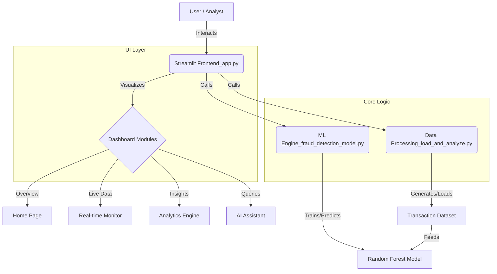

# Fraud Detection System - README.md

[](https://streamlit.io)


A sophisticated, real-time **Financial Fraud Detection System** powered by Machine Learning. This application monitors transactions, detects anomalies using a Random Forest model, and provides an interactive dashboard for financial analysts.

## 🚀 Key Features

*   **Real-time Monitoring**: Live visualization of transaction traffic and threat levels.
*   **Advanced ML Model**: Random Forest Classifier trained on balanced datasets (SMOTE) to detect fraud with high precision.
*   **Interactive Analytics**: Deep dive into transaction data with Plotly charts and heatmaps.
*   **AI Assistant**: A multilingual chatbot (English, Hindi, Kannada) to answer queries and generate reports.
*   **Professional UI**: Multiple themes (Neon Cyberpunk, Professional Blue, Light/Dark Mode) with a cleaner, bolder interface.
*   **Secure & Fast**: Optimized performance with cached model loading and synthetic data generation.

## 🏗️ Architecture



The system follows a modular architecture:
1.  **Frontend**: Built with **Streamlit** for a responsive, interactive web interface.
2.  **Data Layer**: Handles data ingestion and synthetic generation using **NumPy** and **Pandas**.
3.  **ML Engine**: Uses **Scikit-learn** for model training (Random Forest) and **Imbalanced-learn** (SMOTE) for handling class imbalance.
4.  **Visualization**: Powered by **Plotly**, **Matplotlib**, and **Seaborn**.

## 🛠️ Tech Stack

-   **Language**: Python 3.x
-   **Web Framework**: Streamlit
-   **Machine Learning**: Scikit-Learn, Imbalanced-Learn
-   **Data Manipulation**: Pandas, NumPy
-   **Visualization**: Plotly, Seaborn, Matplotlib
-   **Utilities**: ReportLab (PDF generation), Streamlit-Lottie (Animations)

## 📦 Installation

1.  **Clone the repository**:
    ```bash
    git clone https://github.com/yourusername/fraud-detection-project.git
    cd fraud-detection-project
    ```

2.  **Install dependencies**:
    ```bash
    pip install -r requirements.txt
    ```

3.  **Run the application**:
    ```bash
    streamlit run app.py
    ```

## 📊 Model Performance

The system uses a **Random Forest Classifier** optimized for fraud detection:
-   **Handling Imbalance**: Uses Synthetic Minority Over-sampling Technique (SMOTE).
-   **Metrics**: Prioritizes **Recall** (to catch all fraud) and **Precision** (to minimize false alarms).
-   **Optimization**: Tuned hyperparameters (`n_estimators`, `max_depth`) for real-time inference speed.

## 🎨 Themes

Navigate to **System Settings** in the sidebar to switch between:
-   🌌 **Neon Cyberpunk** (High contrast, futuristic)
-   b  **Professional Blue** (Corporate, clean)
-   ☀️ **Light Mode** (Bright, accessible)
-   🌑 **Dark Mode** (OLED friendly)

## 🤝 Contributing

Contributions are welcome! Please fork the repository and submit a Pull Request.

## 📜 License

This project is licensed under the MIT License.
